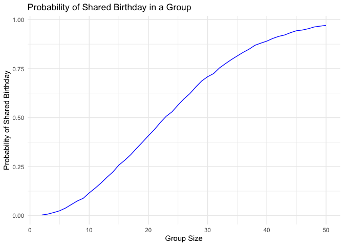

p8105_hw5_sd3730
================
Stacey Dai
2024-11-14

``` r
library(ggplot2)
library(dplyr)
```

# Problem 1

First, I will create a function to check if there are duplicate
birthdays in a group of ‘n’ people.

``` r
has_duplicate_birthday = function(n) {
  birthdays = sample(1:365, n, replace = TRUE)
  
  return(any(duplicated(birthdays)))
}
```

Then, I will run the simulation 10,000 times for each group size and
compute the probability of at least two people sharing a birthday.

``` r
set.seed(123)

probabilities = sapply(2:50, function(n) {
  mean(replicate(10000, has_duplicate_birthday(n)))
})
```

This is a plot that visualizes how the probability changes as the group
size increases.

``` r
prob_data = data.frame(
  group_size = 2:50, 
  probability = probabilities
)

ggplot(prob_data, aes(x = group_size, y = probability)) +
  geom_line(color = "blue") +
  labs(
    title = "Probability of Shared Birthday in a Group",
    x = "Group Size",
    y = "Probability of Shared Birthday"
  ) +
  theme_minimal()
```

<!-- --> The graph
illustrate that as group size increases, the probability of at least two
people sharing a birthday rises sharply. As the group size approaches
50, the probability nears 100%, meaning it’s almost certain that two
people will share a birthday in larger groups. This trend highlights how
quickly the likelihood of shared birthdays increases with group size,
even when birthdays are assumed to be evenly distributed.
