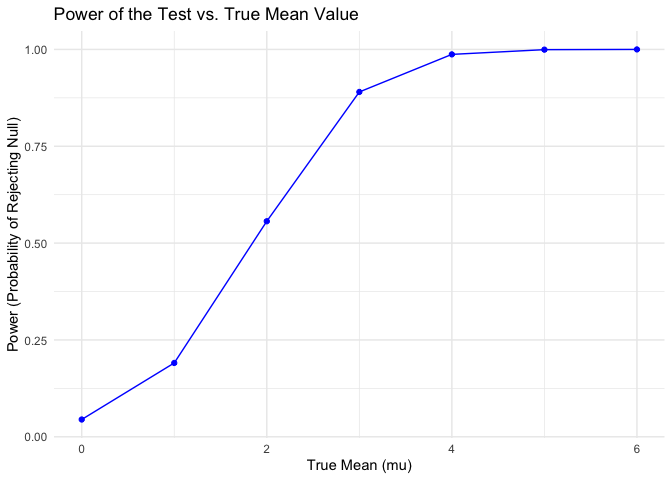
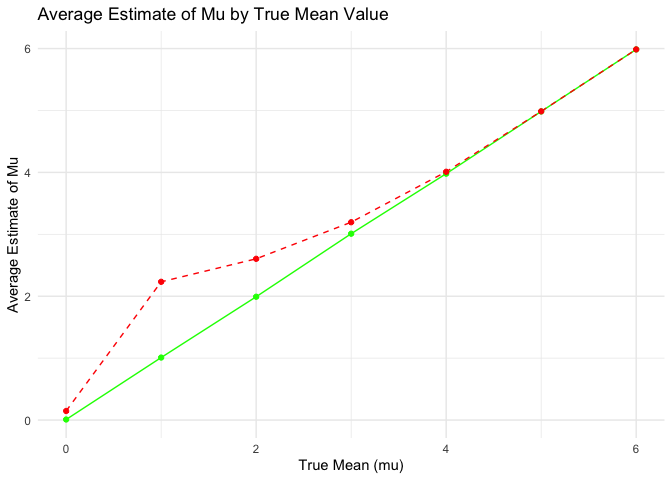

p8105_hw5_sd3730
================
Stacey Dai
2024-11-14

``` r
library(ggplot2)
library(dplyr)
library(broom)
```

# Problem 1

#### Create a function to check if there are duplicate birthdays in a group of ‘n’ people.

``` r
has_duplicate_birthday = function(n) {
  birthdays = sample(1:365, n, replace = TRUE)
  
  return(any(duplicated(birthdays)))
}
```

#### Run the simulation 10,000 times for each group size and compute the probability of at least two people sharing a birthday.

``` r
set.seed(123)

probabilities = sapply(2:50, function(n) {
  mean(replicate(10000, has_duplicate_birthday(n)))
})
```

#### Plot the probability changes as the group size increases.

``` r
prob_data = data.frame(
  group_size = 2:50, 
  probability = probabilities
)

ggplot(prob_data, aes(x = group_size, y = probability)) +
  geom_line(color = "blue") +
  labs(
    title = "Probability of Shared Birthday in a Group",
    x = "Group Size",
    y = "Probability of Shared Birthday"
  ) +
  theme_minimal()
```

<!-- --> The graph
illustrate that as group size increases, the probability of at least two
people sharing a birthday rises sharply. As the group size approaches
50, the probability nears 100%, meaning it’s almost certain that two
people will share a birthday in larger groups. This trend highlights how
quickly the likelihood of shared birthdays increases with group size,
even when birthdays are assumed to be evenly distributed.

# Problem 2

#### Define the parameters.

``` r
n = 30
sigma = 5
mu_vals = 0:6
alpha = 0.05
n_sim = 5000
```

#### Define a function to simulate data, calculate the sample mean and p-value, and return results for each dataset.

``` r
simulate_t_test = function(mu, n, sigma, alpha) {
  sample_data = rnorm(n, mean = mu, sd = sigma)
  
  t_test_result = t.test(sample_data, mu = 0)
  
  test_summary = broom::tidy(t_test_result)
  
  tibble(
    mu_true = mu,
    mu_hat = test_summary$estimate,
    p_value = test_summary$p.value
  )
}
```

#### Run simulations for each true mean value.

``` r
set.seed(123)

simulation_results = bind_rows(
  lapply(mu_vals, function(mu) {
    replicate(n_sim, simulate_t_test(mu, n, sigma, alpha), simplify = FALSE) |>
      bind_rows()
  })
)
```

#### Calculate power and average estimates.

``` r
results_summary = simulation_results |>
  group_by(mu_true) |>
  summarize(
    power = mean(p_value < alpha),
    avg_mu_hat = mean(mu_hat),
    avg_mu_hat_reject = mean(mu_hat[p_value < alpha])
  )
```

#### Plot the power curve.

``` r
ggplot(results_summary, aes(x = mu_true, y = power)) +
  geom_line(color = "blue") +
  geom_point(color = "blue") +
  labs(
    title = "Power of the Test vs. True Mean Value",
    x = "True Mean (mu)",
    y = "Power (Probability of Rejecting Null)"
  ) +
  theme_minimal()
```

<!-- --> This plot shows
that the power of the test (the probability of rejecting the null
hypothesis) increases as the true mean mu grows, reaching near certainty
(power close to 1) when mu \>/= 4. This indicates that larger effect
sizes makes it much more likely to detect a true effect.

#### Plot the average estimates.

``` r
ggplot(results_summary, aes(x = mu_true)) +
  geom_line(aes(y = avg_mu_hat), color = "green") +
  geom_point(aes(y = avg_mu_hat), color = "green") +
  geom_line(aes(y = avg_mu_hat_reject), color = "red", linetype = "dashed") +
  geom_point(aes(y = avg_mu_hat_reject), color = "red") +
  labs(
    title = "Average Estimate of Mu by True Mean Value",
    x = "True Mean (mu)",
    y = "Average Estimate of Mu"
  ) +
  theme_minimal() +
  scale_color_manual(values = c("green", "red")) +
  theme(legend.position = "none")
```

<!-- --> This plot
illustrates the average estimate of mu as a function of the true mean.
The green line represents the average estimate of mu across all
simulations, which closely follows the true mu, showing that the
estimator is unbiased. The red dashed line shows the average mu estimate
only in cases where the null hypothesis was rejected. Here, the
estimates are slightly higher than the true mu for smaller values,
indicating a selection bias; only larger estimates tend to reject the
null, skewing the mean upward in those cases.

# Problem 3

#### Load the data and describe it

``` r
library(tidyverse)
homicides_data <- read_csv("https://raw.githubusercontent.com/washingtonpost/data-homicides/master/homicide-data.csv")
```

#### Create the city_state variable and summarize homicides

``` r
homicides_data = homicides_data |>
  mutate(city_state = str_c(city, ", ", state))

homicides_summary = homicides_data |>
  group_by(city_state) |>
  summarize(
    total_homicides = n(),
    unsolved_homicides = sum(disposition %in% c("Closed without arrest", "Open/No arrest"))
  )
```

#### Estimate the proportion of unsolved homicides for Baltimore

``` r
baltimore_data = homicides_summary |>
  filter(city_state == "Baltimore, MD")

baltimore_prop_test = prop.test(
  baltimore_data$unsolved_homicides,
  baltimore_data$total_homicides
)

baltimore_results = tidy(baltimore_prop_test) |>
  select(estimate, conf.low, conf.high)
```

#### Estimate proportion of unsolved homicides for all cities

``` r
homicides_summary = homicides_data |>
  mutate(city_state = str_c(city, ", ", state)) |>
  group_by(city_state) |>
  summarize(
    total_homicides = n(),
    unsolved_homicides = sum(disposition %in% c("Closed without arrest", "Open/No arrest"))
  )

homicides_summary = homicides_summary |>
  filter(total_homicides >= 10) |>
  mutate(
    prop_test = map2(unsolved_homicides, total_homicides, ~prop.test(.x, .y)),
    prop_results = map(prop_test, tidy)
  ) |>
  unnest(prop_results) |>
  select(city_state, estimate, conf.low, conf.high)
```
